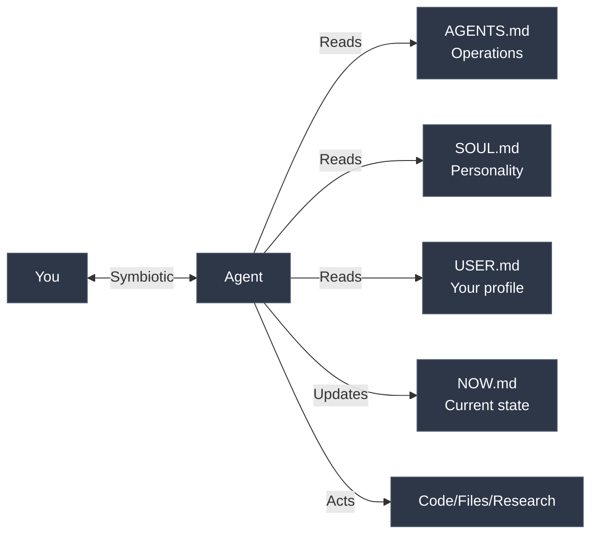

# AI Life Assistant

A symbiotic AI agent that remembers everything, challenges you, and extends your cognition. Works across Claude Code, opencode, nanobot, and any LLM interface.

<a href="https://www.youtube.com/watch?v=oBURNsNVU3Y"></a>

[Watch the video](https://www.youtube.com/watch?v=oBURNsNVU3Y)

## What This Is

Four files that turn any AI into a symbiotic agent:
- **Memory** - Persistent context across all sessions
- **Challenge** - Calls out your patterns, not just validates you
- **Autonomy** - Acts directly (code, files, research)

**The key difference:** Not a chatbot. An agent that lives in your filesystem, remembers your context, sees patterns you miss, and operates alongside you.

## How It Works



**The Philosophy:** Symbiotic AI through transparency. All memory lives in files you control. The agent builds context over time, challenges your blind spots, and you see everything it remembers.

## Installation

**One command:**

```bash
curl -fsSL https://raw.githubusercontent.com/lout33/ai-life-assistant/main/install.sh | bash
```

Works with Claude Code, opencode, nanobot, or as a local project. The script auto-detects your setup.

**Windows users:** Run in WSL or Git Bash.

### Manual Installation

**Option 1: Clone**

```bash
git clone https://github.com/lout33/ai-life-assistant
cd ai-life-assistant
```

Then open with your AI coding tool and start talking.

**Option 2: Global Install (Claude Code)**

```bash
mkdir -p ~/.claude
cp AGENTS.md SOUL.md USER.md NOW.md ~/.claude/
# Claude Code reads CLAUDE.md by default, so create it:
cat AGENTS.md SOUL.md USER.md > ~/.claude/CLAUDE.md
```

**Option 3: Global Install (opencode)**

```bash
mkdir -p ~/.config/opencode
cp AGENTS.md SOUL.md USER.md NOW.md ~/.config/opencode/
```

**Option 4: nanobot**

Edit `~/.nanobot/config.json` and set workspace to your life assistant directory:

```json
{
  "agents": {
    "defaults": {
      "workspace": "/path/to/your/ai-life-assistant"
    }
  }
}
```

nanobot reads AGENTS.md, SOUL.md, USER.md, and NOW.md automatically.

## Quick Start

After install, just start talking. That's it.

The agent reads your files at session start. It knows your identity, your current projects, your patterns. No commands needed. It adapts to whatever you're doing.

## Commands

Built-in commands for daily rituals:

| Command | What it does |
|---------|--------------|
| `/start-day` | Morning kickoff. Sets your MIT (Most Important Task) for the day. |
| `/check-day` | Quick check-in anytime. Accountability without friction. |
| `/end-day` | Evening review. Captures wins, lessons, updates the log. |
| `/reflect` | Deep reflection. Creates journal entries, surfaces patterns. |

Just type the command. The agent handles the rest.

## The 4-File System

| File | Purpose | Stability |
|------|---------|-----------|
| `AGENTS.md` | Operations, rules, how the agent works | Stable |
| `SOUL.md` | Agent personality, identity | Stable |
| `USER.md` | Your profile, psychology, patterns | Stable |
| `NOW.md` | Current state, queue, memory log | Dynamic |

**Why 4 files?**

Separation of concerns:
- **AGENTS.md** = How the system operates (rules, session protocol, file locations)
- **SOUL.md** = Who the agent is (personality, stance, key questions)
- **USER.md** = Who you are (identity, mission, psychology, bugs)
- **NOW.md** = What's happening now (tasks, projects, memory log)

Stable files rarely change. NOW.md changes every session. The agent reads all four, updates NOW.md as you work.

**Conversation > Documentation**

You talk. The agent acts and maintains the files. No manual editing required (though you can if you want).

## Interoperability

This system works as a **single source of truth** across multiple AI frameworks:

```
┌─────────────────────────────────────────────────────┐
│           Your Life Assistant Directory             │
│  ┌──────────┐ ┌────────┐ ┌────────┐ ┌────────┐     │
│  │ AGENTS.md│ │SOUL.md │ │USER.md │ │ NOW.md │     │
│  └──────────┘ └────────┘ └────────┘ └────────┘     │
└─────────────────────────────────────────────────────┘
         │              │              │
         ▼              ▼              ▼
   ┌──────────┐  ┌──────────┐  ┌──────────┐
   │Claude Code│  │ opencode │  │ nanobot  │
   │           │  │          │  │(Telegram)│
   └──────────┘  └──────────┘  └──────────┘
```

**The idea:** One directory, multiple interfaces. Use Claude Code for deep coding sessions, opencode for terminal work, nanobot for Telegram/cron automation. All reading from the same files.

### Framework Compatibility

| Framework | Bootstrap Files | Config Location |
|-----------|-----------------|-----------------|
| Claude Code | CLAUDE.md (concatenate the 4 files) | `~/.claude/` |
| opencode | AGENTS.md, SOUL.md, USER.md, NOW.md | `~/.config/opencode/` or project root |
| nanobot | AGENTS.md, SOUL.md, USER.md, NOW.md | Set `workspace` in config.json |

### Memory Coexistence

If using nanobot alongside other tools:
- **NOW.md** remains your primary state/queue/log file
- **nanobot's memory/** folder can coexist for its own notes
- Both systems can read/write without conflict

## What Makes It Different

### It Challenges You

Most AI validates. This one calls you out.

From a real conversation:
> **AI:** "You find something valuable -> People want it -> You feel repulsed by the exchange -> You give it away for free -> You have no money -> Repeat."
>
> **AI:** "That's not idealism. That's self-punishment."

The instruction is simple: *"No coddling. Quote the user's words back when off track."*

### It Remembers

This isn't a one-off ChatGPT session. The agent has persistent memory: your values, your goals, your known bugs, your history.

When it says "You did this with the Blender addon, paying customers, real traction, and you gave it away," it's not guessing. It remembered.

### It Acts

Not just chat. The agent executes: writes code, researches, creates files, runs commands. It operates alongside you, not just advises.

## How It Works (Data Flow)

**Local:**
- All your files (`AGENTS.md`, `SOUL.md`, `USER.md`, `NOW.md`) are stored on your machine
- You own and control all data
- Safe to version control (but consider `.gitignore` for personal files)

**Cloud:**
- Conversations are processed through your AI provider's API (Anthropic, OpenAI, etc.)
- API usage costs apply based on your provider's pricing
- Your provider's privacy policy applies to conversation data

**Want full privacy?** This file-based system works with any LLM. For local-only processing, use with Ollama or LM Studio.

## The Memory Log (Secret Sauce)

In `NOW.md`, the agent maintains a dated log:
- Patterns it notices over time
- Your exact words (quoted)
- Breakthroughs and insights
- Connections across conversations

**This is what makes it symbiotic.** The agent sees patterns you miss, remembers what you forget, and builds context across sessions.

Example progression:
```
### Week 1, Jan 7
- Setup complete. Known bug: 'I keep adding features instead of launching'

### Week 1, Jan 10
- Avoided user call. Rescheduled twice. Pattern: building = safe, talking = scary.

### Week 2, Jan 15
- Had first user call. Quote: 'I've been building what I think they want instead of asking'

### Week 4, Feb 1
- Pattern confirmed: 3 weeks of work on feature nobody asked for. This is the 3rd time.
```

The longer you use it, the better it gets.

## Examples

Check `examples/` for real progressions:
- **alex-founder** - Solo founder building SaaS, racing against runway
- **maya-creator** - Marketing manager building content side hustle
- **rick-developer** - Backend dev job hunting after layoff
- **sam-student** - Career changer learning to code part-time

Each shows Week 1 to Month 3 evolution with Memory Log progression.

## Who This Is For

**You want AI that knows you and challenges you:**
- Builders who want a symbiotic relationship with AI
- People exploring human-AI integration
- Anyone tired of re-explaining context every session
- Developers building a life OS (not just a todo list)

**You probably won't like this if:**
- You want a simple chatbot (this is deeper integration)
- You're uncomfortable with AI that pushes back
- You prefer apps over files
- You don't want persistent memory

## Philosophy

**Symbiotic > Assistive** - The agent operates with you, not for you

**Challenge > Validate** - Honest reflection beats comfortable agreement

**Memory compounds** - The longer you use it, the better it gets

**Ship ugly** - Done beats perfect

## Advanced: Full Life OS

This template covers the basics. My personal setup includes:

- **Skills ecosystem** - Search, research, image generation, and more
- **Agent delegation** - Spawn sub-agents for complex tasks
- **Integrated journal** - Daily entries with AI pattern recognition
- **Telegram/cron automation** - Daily reminders, check-ins via nanobot

Interested in the full system? **Let me know** (feedback helps prioritize what to build next).

## Requirements

- An AI coding interface (Claude Code, opencode, Cursor, or any LLM that supports custom instructions)
- A folder for your life system

## Related Projects

Part of the symbiotic AI ecosystem:

| Project | What it does |
|---------|--------------|
| [what-did-i-do](https://github.com/lout33/what-did-i-do) | Know what you actually did today. Passive screen tracker that captures screenshots, analyzes with Gemini Vision, and creates daily activity reports. |
| [writing-style-skill](https://github.com/lout33/writing-style-skill) | Make AI write like you. Export your emails/chats, extract your patterns, transform any AI text into your voice. |

More skills coming. Star to follow.

## Credits

Created by [@lout33](https://github.com/lout33)

Built on the belief that symbiotic AI means shared cognition, not supervision. The agent operates with you, not for you.

---

*"The solution isn't a better system. It's doing the uncomfortable thing you're avoiding."*

---


## Star History

[](https://star-history.com/#lout33/ai-life-assistant&Date)
